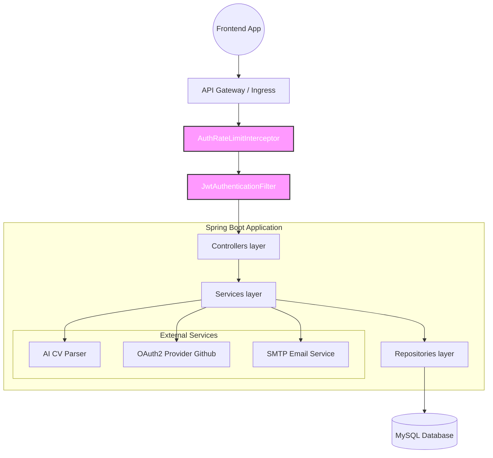
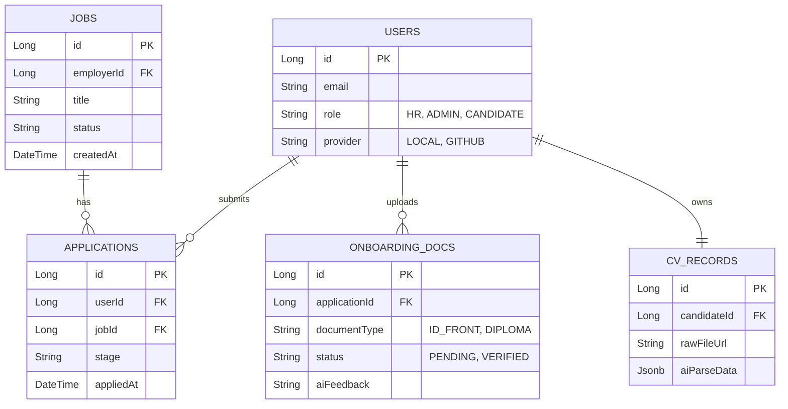

<div align="center">
  
</div>

# SmartHire Backend API ⚙️

The robust, secure, and highly scalable backend engine underlying the **SmartHire ATS (Applicant Tracking System)**. Built with Java Spring Boot, this sophisticated microservice-ready backend handles intricate job operations, candidate profiling, AI-powered CV parsing logic, security, and document verification workflows.

## 🛠 Tech Stack

| Layer | Core Technology | Supporting Libraries |
| :--- | :--- | :--- |
| **Framework** | Java 17, Spring Boot 3.x | Spring Web, Spring Validation |
| **Security** | Spring Security 6 | JWT (io.jsonwebtoken), OAuth2 Client |
| **Database** | MySQL 8.0+ | Spring Data JPA, Hibernate, HikariCP |
| **Integrations** | External APIs | Third-party AI parsing/Email SMTP |
| **Testing** | JUnit 5, Mockito | Spring Boot Test |
| **DevOps** | Docker, Docker Compose | Multi-stage Temurin JRE builds |

---

## 📐 System Architecture Flow

The application follows a strict layered architecture to ensure separation of concerns, maintainability, and security.



---

## 🗄 Entity Relationship Flow (Core Schema)

Our relational database structure is designed to heavily normalize ATS operations while keeping analytical queries fast.



---

## ✨ Comprehensive Features

### 🔐 1. Enterprise-Grade Authentication
- **Hybrid Security**: Supports both traditional Local (Email/Password) auth via BCrypt and **GitHub OAuth2**.
- **Stateless Sessions**: Powered entirely by robust JSON Web Tokens (Access + Refresh tokens).
- **Brute-force Protection**: In-memory `AuthRateLimitInterceptor` protecting login and registration endpoints.
- **Role-Based Access Control (RBAC)**: Fine-grained method-level security (`@PreAuthorize`) differentiating `CANDIDATE`, `HR`, and `ADMIN`.

### 📄 2. AI-Powered CV Engine
- **Asynchronous Parsing**: Endpoints that accept multipart file uploads (PDF/DOCX), interfacing with AI engines to extract detailed structured candidate data (Experience, Education, Skills).
- **Data Normalization**: Translates chaotic, raw PDF text into predictable JSON DTOs consumable by the frontend builder.

### 🏢 3. Employer & Job Management
- **Dynamic Job Feeds**: Highly optimized Spring Data JPA queries to retrieve latest postings.
- **Kanban Pipelines**: Endpoints designed specifically for HR to drag and drop candidates across pipeline stages (Sourced -> Interview -> Hired).

### 📑 4. Document Verification & Onboarding
- **Secure PII Storage**: Dedicated entity structures (`OnboardingDocument`) mapping to secure storage.
- **AI Verification Hooks**: Triggers for verifying properties strictly matching uploaded HR compliance documents (Frontend ID matching).

---

## 📦 Getting Started

### Prerequisites
- **Java JDK 17**
- **Maven 3.8+**
- **MySQL Server 8.0+**
- **Docker & Docker Compose** (Optional but recommended)

### 1. Unified Docker Deployment
We provide a robust `docker-compose.yml` to spin up both the MySQL database and the Backend API instantly.

```bash
git clone https://github.com/khoazandev/smart-hire-backend.git
cd smart-hire-backend

# Builds the app via Multi-Stage Dockerfile and starts MySQL
docker-compose up -d --build
```
*The API will be available at `http://localhost:8080/api/v1`*

### 2. Manual Local Development
```bash
# Provide environment variables in your terminal or IntelliJ Run Config
export DB_HOST=127.0.0.1
export DB_PORT=3306
export DB_NAME=smart_hire
export DB_USERNAME=root
export DB_PASSWORD=your_password
export JWT_SECRET=your_256_bit_secret

# Package and Run
./mvnw clean compile spring-boot:run
```

---

## 🔑 Environment Variables List

Create an `application-prod.properties` or set these in the Docker container:

| Variable | Description |
| :--- | :--- |
| `DB_HOST` | MySQL host |
| `DB_PORT` | MySQL port |
| `DB_NAME` | MySQL database name |
| `DB_USERNAME` | Database user |
| `DB_PASSWORD` | Database password |
| `JWT_SECRET` | 256-bit secret for JWT signing |
| `APP_JWT_EXPIRATION` | Access token lifespan (ms) |
| `APP_JWT_REFRESH_EXPIRATION`| Refresh token lifespan (ms) |
| `APP_OAUTH2_GITHUB_CLIENT_ID`| GitHub OAuth App Client ID |
| `APP_OAUTH2_GITHUB_CLIENT_SECRET`| GitHub OAuth App Secret |
| `FRONTEND_URL` | Application client URL (Default: `http://localhost:3000`) |
| `CORS_ALLOWED_ORIGINS` | Comma-separated allowed browser origins |

---
<div align="center">
  <i>Developed and Optimized for Production Readiness</i><br>
  <b>v1.0.0 Release</b>
</div>
