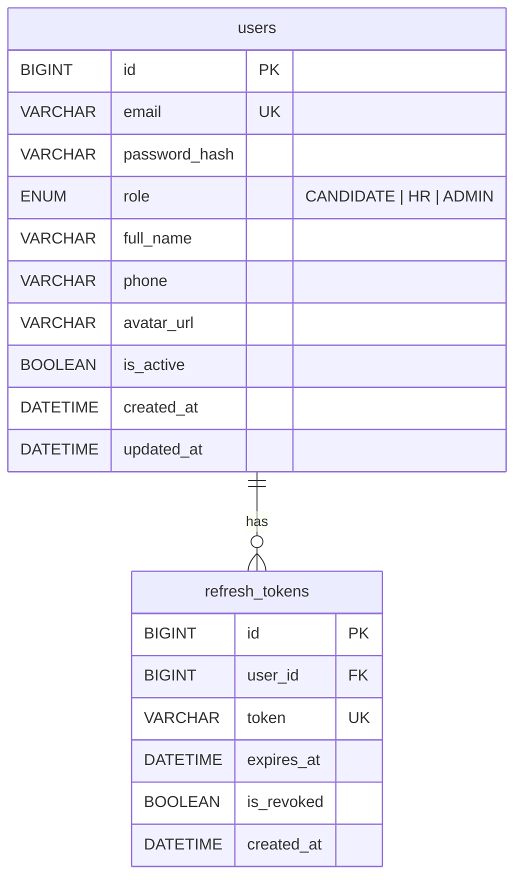
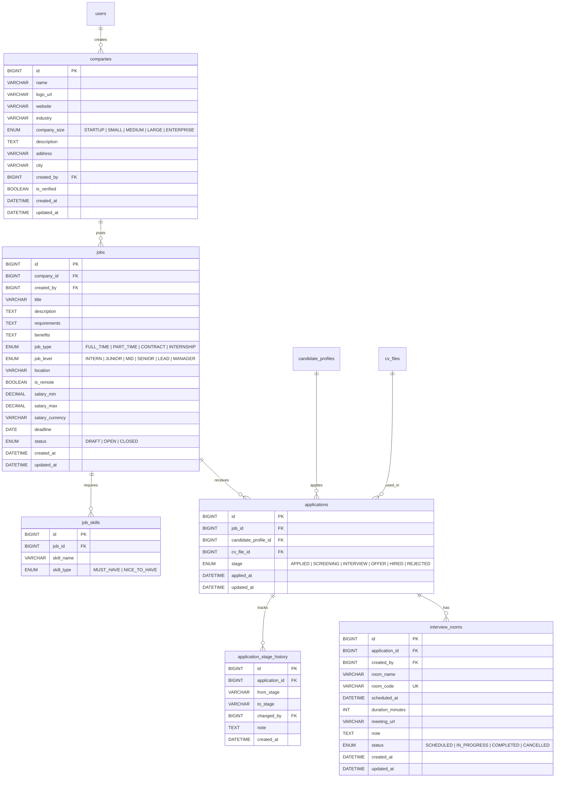
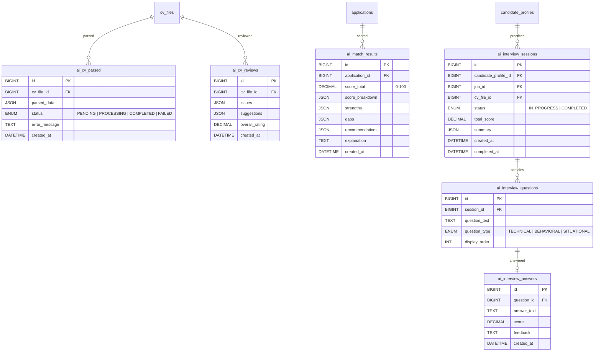
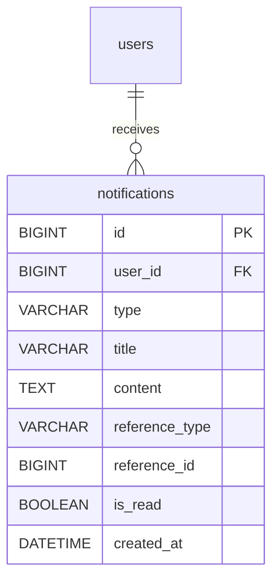
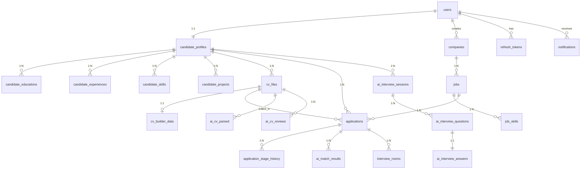

# SmartHire - Database Design (Student Project)

## 1. Tổng quan

Thiết kế database gồm **22 bảng** chia theo 5 module:

| Module            | Bảng                                                                                                                                           | Mô tả                 |
| ----------------- | ---------------------------------------------------------------------------------------------------------------------------------------------- | --------------------- |
| M0 - Core         | `users`, `refresh_tokens`                                                                                                                      | Auth & RBAC           |
| M1 - Candidate    | `candidate_profiles`, `candidate_educations`, `candidate_experiences`, `candidate_skills`, `candidate_projects`, `cv_files`, `cv_builder_data` | Hồ sơ & CV Builder    |
| M2 - Employer     | `companies`, `jobs`, `job_skills`, `applications`, `application_stage_history`, `interview_rooms`                                              | Tuyển dụng & pipeline |
| M3 - AI           | `ai_cv_parsed`, `ai_match_results`, `ai_cv_reviews`, `ai_interview_sessions`, `ai_interview_questions`, `ai_interview_answers`                 | AI xử lý & đánh giá   |
| M4 - Notification | `notifications`                                                                                                                                | Thông báo realtime    |

> **Lưu ý:** `cv_builder_data` phân biệt CV tạo từ Builder vs Upload. `ai_cv_parsed` lưu kết quả AI trích xuất. `interview_rooms` phục vụ tính năng streaming phỏng vấn trực tuyến.

---

## 2. ERD - Entity Relationship Diagram

### 2.1 Module 0: Core Platform



### 2.2 Module 1: Candidate Portal

```mermaid
erDiagram
    users ||--|| candidate_profiles : "has"
    candidate_profiles ||--o{ candidate_educations : "has"
    candidate_profiles ||--o{ candidate_experiences : "has"
    candidate_profiles ||--o{ candidate_skills : "has"
    candidate_profiles ||--o{ candidate_projects : "has"
    candidate_profiles ||--o{ cv_files : "owns"

    candidate_profiles {
        BIGINT id PK
        BIGINT user_id FK_UK
        VARCHAR headline
        TEXT summary
        DATE date_of_birth
        ENUM gender "MALE | FEMALE | OTHER"
        VARCHAR address
        VARCHAR city
        INT years_of_experience
        ENUM job_level "INTERN | JUNIOR | MID | SENIOR | LEAD | MANAGER"
        DATETIME created_at
        DATETIME updated_at
    }

    candidate_educations {
        BIGINT id PK
        BIGINT candidate_profile_id FK
        VARCHAR institution
        VARCHAR degree
        VARCHAR field_of_study
        DATE start_date
        DATE end_date
        DECIMAL gpa
        TEXT description
    }

    candidate_experiences {
        BIGINT id PK
        BIGINT candidate_profile_id FK
        VARCHAR company_name
        VARCHAR title
        DATE start_date
        DATE end_date
        BOOLEAN is_current
        TEXT description
    }

    candidate_skills {
        BIGINT id PK
        BIGINT candidate_profile_id FK
        VARCHAR skill_name
        ENUM proficiency_level "BEGINNER | INTERMEDIATE | ADVANCED | EXPERT"
    }

    candidate_projects {
        BIGINT id PK
        BIGINT candidate_profile_id FK
        VARCHAR project_name
        TEXT description
        TEXT technologies
    }

    cv_files {
        BIGINT id PK
        BIGINT candidate_profile_id FK
        VARCHAR file_name
        VARCHAR file_path
        ENUM file_type "PDF | DOCX"
        ENUM source "UPLOAD | BUILDER"
        INT file_size
        BOOLEAN is_primary
        DATETIME created_at
    }

    cv_builder_data {
        BIGINT id PK
        BIGINT cv_file_id FK_UK
        BIGINT candidate_profile_id FK
        VARCHAR template_id
        JSON sections_data
        DATETIME created_at
        DATETIME updated_at
    }

    cv_files ||--o| cv_builder_data : "has"
```

### 2.3 Module 2: Employer/HR Portal



### 2.4 Module 3: AI Service



### 2.5 Module 4: Notification



---

## 3. Tổng quan quan hệ (Full ERD)



---

## 4. Mapping chức năng → Bảng DB

| #          | Chức năng                      | Bảng phục vụ                                                              |
| ---------- | ------------------------------ | ------------------------------------------------------------------------- |
| 1          | Đăng ký, đăng nhập, RBAC       | `users`, `refresh_tokens`                                                 |
| 2          | Hồ sơ ứng viên + công ty       | `candidate_profiles`, `candidate_*`, `companies`                          |
| 3          | Đăng tin + pipeline (realtime) | `jobs`, `job_skills`, `applications`, `application_stage_history`         |
| 4          | AI trích xuất CV               | `ai_cv_parsed`                                                            |
| 5          | AI matching CV-JD + chấm điểm  | `ai_match_results`                                                        |
| 6          | Gợi ý job/ứng viên             | `ai_match_results` (query by score)                                       |
| 7          | Theo dõi trạng thái            | `applications`, `application_stage_history`                               |
| 8          | Dashboard thống kê             | Query aggregate từ `applications`, `jobs`, `ai_match_results`             |
| 9          | Thông báo                      | `notifications`                                                           |
| **Thầy 1** | CV Builder                     | `cv_builder_data`, `cv_files`                                             |
| **Thầy 2** | AI review/chấm CV              | `ai_cv_reviews`                                                           |
| **Thầy 3** | Phỏng vấn ảo AI                | `ai_interview_sessions`, `ai_interview_questions`, `ai_interview_answers` |
| **Thầy 4** | Từ CV tạo câu hỏi              | `ai_interview_sessions.cv_file_id` → `ai_interview_questions`             |
| **Thầy 5** | HR streaming Meet              | `interview_rooms`                                                         |
| **Thầy 6** | Toàn bộ trên hệ thống          | Tất cả bảng trên                                                          |

## 5. Điểm thiết kế chính

| Nghiệp vụ             | Giải pháp                                                              |
| --------------------- | ---------------------------------------------------------------------- | --- | ------------- | ------------------------------------------------------------------ | --- | ----------------- | ------------------------------------------------- |
| **Chống apply trùng** | `UNIQUE(job_id, candidate_profile_id)` trên `applications`             |
| **Pipeline tracking** | `applications.stage` (current) + `application_stage_history` (history) |
| **CV Builder**        | `cv_builder_data.sections_data` (JSON) lưu form data → export PDF      |     | **source CV** | `cv_files.source` = UPLOAD \| BUILDER — phân biệt loại CV trong UI |     | **AI CV parsing** | `ai_cv_parsed` extract structured JSON từ CV file |
| **Video Interview**   | `interview_rooms` với `room_code` unique để join phòng                 |
| **RBAC**              | `users.role` = CANDIDATE / HR / ADMIN                                  |
| **AI scoring**        | `score_breakdown` (JSON) chứa skills_match, exp_match, semantic_match  |
| **Notification**      | Polymorphic reference (`reference_type` + `reference_id`)              |
| **Full-text search**  | FULLTEXT index trên `jobs(title, description, requirements)`           |
